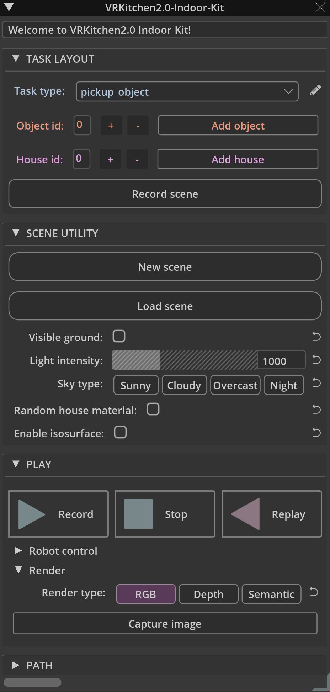
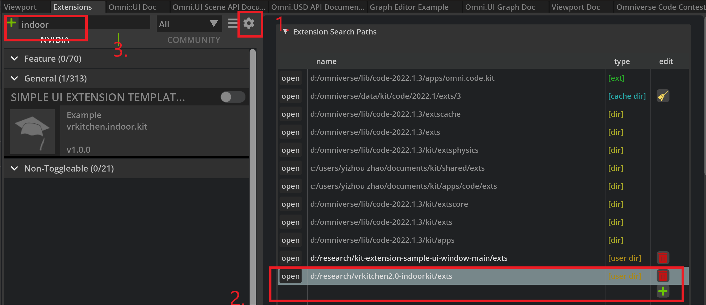

# Omniverse IndoorKit Extension


This extension allows to load and record indoor scene tasks for robotics. 

In the field of robotics, it requires a lot of effort to set up even a simple task (e,g. pick up an object) for a robot in the real scene. At present, with the help of Omniverse, not only can we set up tasks for robots in a **photo-realistic** and **physics-reliable** manner, but we build this extension to bring high-quality content with a wide range of **variability** and **randomness**. 

Besides, we design a complete pipline to **load and record the scene**, **control and replay the robot actions**, and **render images**d. We hope this work could encourage academic researches in related field.




# Get started with Omniverse Code/Create/Isaac-Sim [version >= 2022]

## Download the [release]() or clone the this repository 

> **Note**:
> The size of the extension including model assets is about 2GB


```
git clone https://github.com/yizhouzhao/VRKitchen2.0-IndoorKit
```

Upzip or locate the root folder as <your-path-to-VRKitchen2.0-IndoorKit>

The file structure of this extension should look like:

```
<your-path-to-VRKitchen2.0-IndoorKit>
    └───asset   [Asset (object, house, e.t.c.) needed for robot tasks]
    └───data    [Folder to save the labeling data]
    └───exts    [Omniverse extenstion]
    └───img   
    └───tool
    │   README.md  
    ......
```

## Add extension to Omniverse

1. **[Open extension manager]** After opening Omniverse Code, go to `Menu` -> `Window` -> `Extension`

2. **[Add this extension to Omniverse]** Click the   button, add absolute extension path to `Extension Search Paths`.

Finally, you can search the `vrkitchen.indoor.kit` and enable this extension.

> **Note**:
> The extension path to add is: `<your-path-to-VRKitchen2.0-IndoorKit>/exts`



# Play with Indoorkit

The functionality of our Indoorkit has three parts:

- TASK LAYOUT: to set up object, robot, and room for one task.
- SCENE UTILITY: to load scene and set up scene features including light, sky, matrial, and e.t.c.
- PLAY: to control the robot to perform and the task.

## 1. Task layout

Start with a new stage,


The `Task layout` module allows users to automatically add the task object, robot, and room. 

a) Click the `task type combo box` to select task type from *Pick up object*, *Reorient object*, *Pour water*, and *Open drawer*.

b) Fill the `object id integer field` (ranging from 0 to 19), then click the `Add object` button to automatically add an object and a franka robot to the scene.

> **Note**:
> Now the robot prim: `/World/game/franka` is selected, you can change the position and rotation of the robot.

c) Fill the `house id integer field` (ranging from 0 to 19), then click the `Add house` button to automatically add a room structure to the task.

> **Note**:
> Now the robot prim: `/World/game/` is automatically selected, you can change the game position and rotation.

d) Click the `Record scene` button to save the scene information (about task type, object, robot, and room) into a json file.  

After recording scene, you can close close the stage without saving.

## 2. Scene utility

-- Load the recorded scene and change scene features.


a) Click `New scene` to open a new stage (with /World and /World/defaultLight only). This this the same as the command: `Menu`->`File`->`New...`

b) Click `Load scene` to load the scene from saved information from `TASK LAYOUT`.

Then you can modify the scene by setting

- `Visible ground`: show ground plane
- `Light intensity`: change the defaultLight intensity
- `Sky type`: change the sky background
- `Random house material`: change floor and wall material

>**Note**: 
>To load the house material requires users to open the `Nucleus` server. The materials are from `Nucleus`.

- `Enable isosurface`: enable isosurface option for water tasks.

## 2. Play


-- play the franka robot.


a) Click `Record` to start playing with the franka robot and recording the robot actions.

To control the robot:

Position the end effector (EE) relative the robot itself, use the `Robot control` UI or the keyboard: 
- [W] Move EE forward; 
- [S] Move EE backward; 
- [A] Move EE to the left; 
- [D] Move EE to the right
- [E] Move EE upward; 
- [D] Move EE downward.

Rotation the end effector (EE), use the `Robot control` UI or the keyboard: 
- [ARROW UP] Rotate EE upward; 
- [ARROW DOWN] Rotate EE downward; 
- [ARROW LEFT] Rotate EE to the left; 
- [ARROW RIGHT] Rotate EE to the right.

To open and close the hand gripper, use the `Robot control` UI or the keyboard: 

- [LEFT CONTROL] Open/Close the gripper.

b) Click `Stop` button to stop playing with the franka robot.

c) Click `Replay` button to replay robot actions.

>**Note**: 
> The `Replay` and `Record` are according to the information of `task type`, `object id`, and `house id`.

You may render the desired type of the image at any time playing, replaying or pausing. Click `Capture image` to get a screenshot.

Finally, you can open the data folders:


# License

- The rooms in this repository are from [3D-FRONT](https://tianchi.aliyun.com/dataset/dataDetail?dataId=65347&lang=en-us), under the [NonCommercial Creative Common License](https://creativecommons.org/licenses/by-nc-sa/4.0/?spm=5176.12282016.0.0.2e917474Ikche7)
- The drawers and bottles in this repository are from [SAPIEN](https://sapien.ucsd.edu/), under this [NonCommercial Term of Use](https://sapien.ucsd.edu/about#term)
- The cups in this repository are from AI2THOR, under the [Apache License](https://github.com/allenai/ai2thor/blob/main/LICENSE).

- This repository is for OMNIVERSE CODE CONTEST, under the [OMNIVERSE PUBLISHING AGREEMENT
](https://developer.download.nvidia.com/Omniverse/secure/Omniverse_Publishing_Agreement_12May2022.pdf?jrPi6OXFm7gWYIsdrQGrSTgF4P3LNZ8cXw3jyHdg--8TYsFEK7bOTc5Az6My5OyURuC8xMU9_Ii1u8H7aPReCvxYFGCrc9VVKVdbfFShmc5sktkTrqywjogIpKeoYLtY-fdBX-WjCl_Vjziylc0Dddy0PXlVdlotRtzLmQ&t=eyJscyI6ImdzZW8iLCJsc2QiOiJodHRwczpcL1wvd3d3Lmdvb2dsZS5jb21cLyJ9).

# Acknowledgement