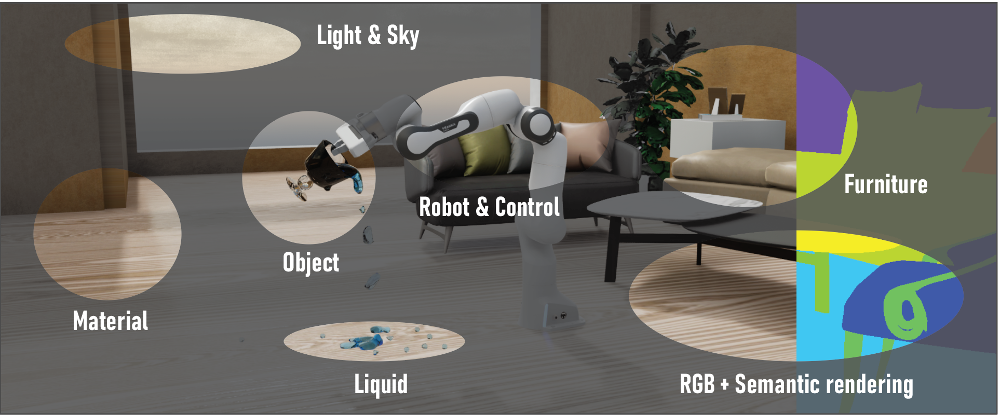

# Omniverse IndoorKit Extension



This extension allows to load and record indoor scene tasks for robotics. 

In the field of robotics, it requires a lot of effort to set up even a simple task (e,g. pick up an object) for a robot in the real scene. At present, with the help of Omniverse, not only can we set up tasks for robots in a **photo-realistic** and **physics-reliable** manner, but we build this extension to bring high-quality content with a wide range of **variability** and **randomness**. 

Besides, we design a complete pipline to **load and record the scene**, **control and replay the robot actions**, and **render images**d. We hope this work could encourage academic researches in related field.


# Getting started with Omniverse Code/Create/Isaac-Sim [version >= 2022]

Download the [release]() or clone the this repository 

> **Note**
> The size of the extension including model assets is about 2GB


```
git clone https://github.com/yizhouzhao/VRKitchen2.0-IndoorKit
```

Upzip or locate the root folder as <your-path-to-VRKitchen2.0-IndoorKit>

Thie 
